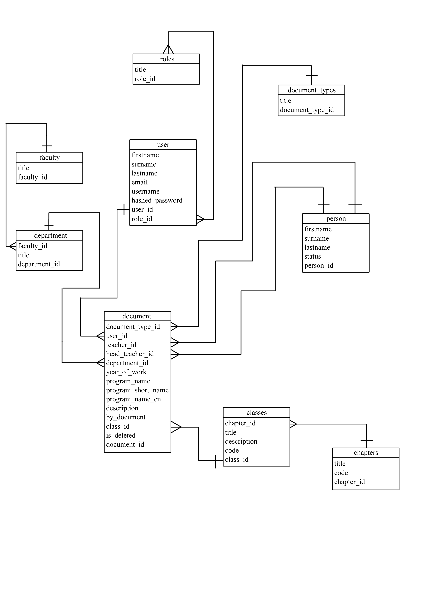

# Для кого?

Разрабатываемая программа в первую очередь нужна студентам образовательных программ Программная инженерия и Прикладная
математика и информатика для упрощения написания документации к курсовым работам в соответствии с ГОСТом, а так же
научным руководителям курсовых проектов, для более комфортного оценивания выполненной студентом документации

# Функциональные требования

1. Управление Ролями:

    - Пользователи могут иметь одну или несколько ролей.
    - Роли предопределены в таблице "roles".
    - Каждая роль имеет уникальное название.
    - У каждого пользователя есть хотя бы одна роль.
    - Роли предопределены в таблице "roles". Возможные роли включают:

        1. Пользователь (User): базовая роль для всех зарегистрированных пользователей.
        2. Модератор (Moderator): имеет право на редактирование записей в таблицах "document_types", "person", "
           department", "
           chapters" и "classes".
        3. Администратор (Administrator): имеет все права модератора и дополнительно управляет ролями пользователей.

    - Система гарантирует, что у каждого пользователя есть хотя бы одна роль.

2. Управление Типами Документов:

    - Документы категоризированы по типам.
    - Типы документов предопределены в таблице "document_types". Доступные типы документов включают:
        1. Техническое задание.
        2. Пояснительная записка.
        3. Текст программы.
        4. Руководство оператора.
    - Каждый тип документа имеет уникальное название.
    - Каждый созданный документ связан с действительным типом документа, предоставляя точную категоризацию и управление
      информацией в системе.

3. Информация о Руководителях Проектов:

   - Система обеспечивает функционал добавления нового руководителя проекта в таблицу "person".
   - При добавлении руководителя проекта необходимо указать его имя (firstname), фамилию (surname), отчество (lastname) и
     статус (status).
   - Идентификатор руководителя проекта (person_id) генерируется автоматически системой.
   - Пользователи с правами администратора или модератора могут изменять статус руководителя проекта, обеспечивая
     актуальность информации.

4. Управление Факультетами и Департаментами:

   - У каждого факультета и кафедры есть уникальное название.
   - Система гарантирует целостность отношений между факультетами и кафедрами.

5. Управление Классами программ:

   - Каждый класс программы должен быть связан с конкретной главой из таблицы "chapters".
   - Информация включает в себя данные, такие как название и код класса программы.
   - Каждый идентификатор класса программы (class_id) уникален, обеспечивая целостность данных.
   - Пользователи имеют возможность выполнять поиск классов программы по названию, коду или другим критериям.

6. Информация о Пользователях:

   - Система предоставляет функционал регистрации новых пользователей.
   - При регистрации пользователя требуется указать уникальный адрес электронной почты, имя пользователя (username) и
     пароль.
   - Каждому зарегистрированному пользователю присваивается уникальный идентификатор (user_id).
   - Система осуществляет проверку подлинности данных, предоставляя доступ к функционалу при успешной авторизации.
   - После авторизации пользователь имеет возможность создавать неограниченное количество различных документов.
   - Пользователь может выбирать руководителей, типы документов, департаменты и другие параметры при создании документов.
   - Система предоставляет возможность пользователям генерировать шаблон документа по готовым параметрам, сохраненным в
     системе.

7. Управление Документами:

   - У каждого документа есть уникальный идентификатор (document_id).
   - Каждый документ связан с уникальным пользователем (user_id), который его сгенерировал.
   - Система обеспечивает корректное отслеживание владельца каждого документа.
   - Система предоставляет функционал управления удалением документов.

8. Управление Ролями Пользователей:

   - Роли пользователей хранятся в таблице "user_roles", связывая пользователей с ролями.
   - Система гарантирует, что у каждого пользователя есть хотя бы одна роль.
   - Роли пользователей предопределены в таблице "roles"
   - Система предоставляет возможность администраторам и модераторам назначать роли пользователям.
   - Роли обеспечивают структурированную систему разграничения прав доступа.
   - Администраторы и модераторы могут изменять роли пользователей в системе.
   - Каждая роль имеет связанные с ней права доступа в системе.
   - Администраторы имеют расширенные права, модераторы могут управлять определенными аспектами, а обычные пользователи
     имеют базовые права.

# Предварительная схема БД

# Ограничения на данные

1. Ограничения на Роли Пользователей:
    - Уникальность названий ролей в таблице "roles".
    - У каждого пользователя есть одна или более ролей

2. Ограничения на Типы Документов:
    - Уникальность названий типов документов в таблице "document_types".

3. Ограничения на Руководителей Проектов:
    - Генерация уникального идентификатора (person_id).

4. Ограничения на Факультеты и Департаменты:
    - Уникальность названий факультетов и департаментов.
    - Гарантия целостности связей между факультетами и кафедрами.

   - У каждого факультета есть один или более департаментов

5. Ограничения на Классификатор программ:
    - Уникальность идентификаторов классов программы (class_id).
    - Обязательная связь каждого раздела с классом кодификатора из таблицы "chapters".

      - У каждого раздела классификаций есть один или более класс классификации.

6. Ограничения на Пользователей:
    - Уникальность адресов электронной почты и имен пользователей при регистрации.
    - Проверка подлинности данных при регистрации и авторизации.

7. Ограничения на Документы:
    - Обязательное привязывание каждого документа к существующему типу документа.
    - Уникальность идентификаторов документов (document_id).
    - Связь каждого документа с уникальным пользователем (user_id), академическим и научным руководителям (person_id)  и
      классификатором (class_id, chapter_id)
    - Возможность управления удалением документов администраторами и модераторами.
    - Доступные типы документов:

    1. Техническое задание.
    2. Пояснительная записка.
    3. Текст программы.
    4. Руководство оператора.
    5. Программа и методика испытаний

   
# Скрипт на SQL DDL
Находится тут: db/init/init.sql
- написание запросов на SQL DML, реализующих функциональные требования
- группировка запросов в транзакции
- разработка пользовательского интерфейса (отдельно не оценивается, может отсутствовать)Оценивание:
  полнота и непротиворечивость функциональных требований - 0..1
  соответствие ER/UML функциональным требованиям - 0..1
  полнота и непротиворечивость множества зависимостей - 0..2
  корректность нормализации - 0..2
  корректность запросов SQL DML - 0..[min(кол-во запросов,3)]бонусы:
  корректность примера проблем из-за недонормализованности - 0..1
  корректность учета нефункциональных требований - 0..1